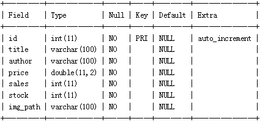
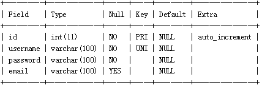
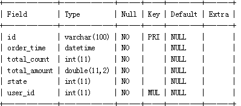
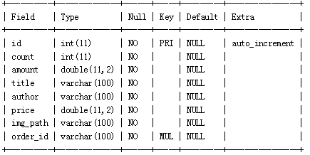

DAO练习
==

## 题目
1. 创建数据库test01_bookstore
1. 创建如下表格
    1. 图书表books
    
    2. 用户表users
    
    3. 订单表orders
    
    4. 订单明细表order_items
    
1. 使用sql语句在命令行或SQLyog中添加一些模拟数据
1. 使用JDBC实现往用户表中添加1个用户，注意密码存储使用mysql的sha1()函数进行加密
    ```text
    sha1算法：可以用commons-codec，
    String DigestUtils.sha1Hex(String str) 方法
    官网：https://commons.apache.org/proper/commons-codec/

    也可以用自定义的Sha1类中的 String getSha1(String str)方法
    ```
1. 使用JDBC实现往图书表中添加1本图书
1. 从键盘输入用户名和密码，模拟登录，使用JDBC实现验证用户名和密码是否正确，如果正确，显示登录成功，否则显示用户名或密码错误
1. 使用JDBC实现查询所有图书信息
1. 使用JDBC实现查询销量最大的图书信息
1. 使用JDBC实现修改库存量小于10本的图书的库存量为100
1. 从键盘输入用户名，实现查询该用户的订单和订单明细
1. 使用JDBC实现删除订单“15275760194821”的相关信息，注意涉及到两张表
