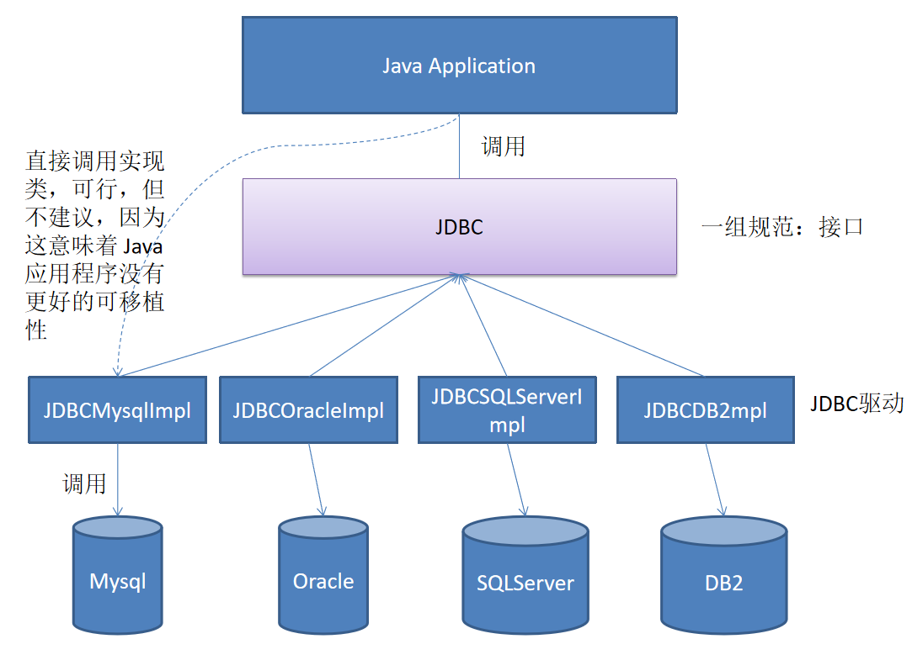
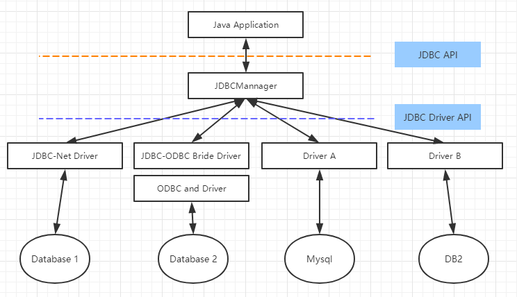
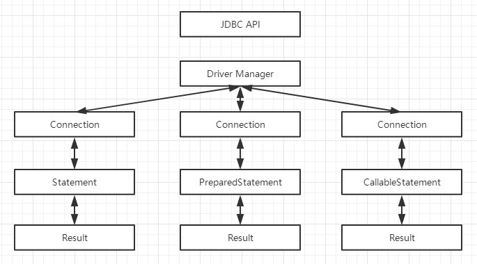
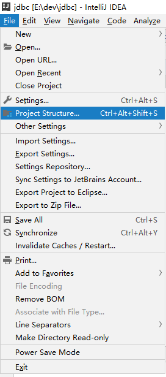
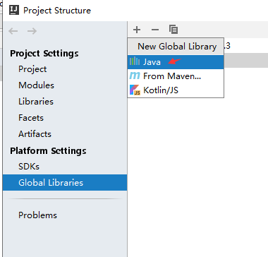
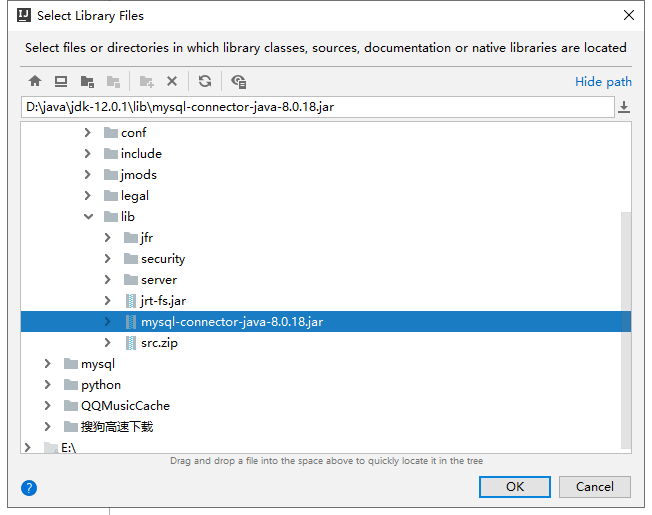
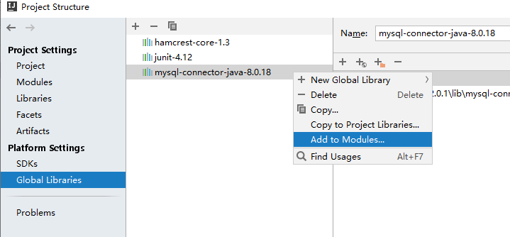

JDBC
==


## java中的数据存储技术
* 连接数据库技术分类
    * JDBC直接访问数据库
    * JDO技术
    * 第三方ORM工具，如Hibernate、ibatis等
**JDBC是java访问数据库的基石，JDO, Hibernate等只是更好的封装了JDBC**


## JDBC概念
```text
* JDBC(Java Database Connectivity)是一个独立于特定数据库管理系统、通用的SQL数据库存取和操作的公共接口（一组API），
定义了用来访问数据库的标准Java类库，使用这个类库可以以一种标准的方法、方便地访问数据库资源

另外：ODBC（Open DataBase Connectivity）

* JDBC为访问不同的数据库提供了一种统一的途径，为开发者屏蔽了一些细节问题

* JDBC的目标是使Java程序员使用JDBC可以连接任何提供了JDBC驱动程序的数据库系统。
简化和加快了开发过程
```
  

### JDBC体系结构
JDBC接口(API)包括两个层次
  

* 面向应用的API
    ```text
    Java API，抽象接口，供应用程序开发人员使用（连接数据库，执行SQL语句，获得结果）
    ```
* 面向数据库的API
    ```text
    Java Driver API，供开发商开发数据库驱动程序用
    ```

JDBC驱动程序：各个数据库厂商根据JDBC的规范制作的 JDBC 实现类的类库

#### JDBC驱动程序四种类型
1. JDBC-ODBC桥
2. 部分本地API部分Java的驱动程序
3. JDBC网络纯Java驱动程序
4. 本地协议的纯 Java 驱动程序

第3、4种性能、可移植性、功能等方面都有优势
* JDBC-ODBC桥
    ```text
    java应用程序 -->JDBC API  -->JDBC-ODBC桥 -->ODBC API -->ODBC层 -->数据库
    
    把标准的 JDBC 调用转换成相应的 ODBC 调用，并通过 ODBC 访问数据库
    要通过多层调用，所以利用JDBC-ODBC 桥访问数据库的效率较低
    JDK中提供相应的驱动：sun.jdbc.odbc.JdbcOdbcDriver
    ```
**ODBC**  
```text
ODBC(Open Database Connectivity),放式数据库连接。微软推出的Windows平台提供统一访问数据库的方式。
所有数据库都可用ODBC API进行访问，ODBC的最大优点是能以统一的方式处理所有的数据库
```

* 部分本地API部分Java的驱动程序
    ```text
    java应用程序 -->JDBC API  -->JDBC驱动程序 -->厂商提供的本地API -->数据库
    ```

* JDBC网络纯Java驱动程序
    ```text
    java应用程序 -->JDBC API  -->JDBC驱动程序 -->应用服务器 -->厂商提供的本地API -->数据库
    ```
* 本地协议的纯 Java 驱动程序
    ```text
    java应用程序 -->JDBC API  -->JDBC驱动程序 -->数据库
    ```

#### JDBC API
```text
是一系列的接口，它使得应用程序能够进行数据库联接，执行SQL语句，并且得到返回结果
```
  

#### Driver接口
```text
* Java.sql.Driver 接口是所有 JDBC 驱动程序需要实现的接口

* 在程序中不需要直接去访问实现了 Driver 接口的类，而是由驱动程序管理器类(java.sql.DriverManager)去调用这些Driver实现
这种方式更灵活
```

* 加载与注册 JDBC 驱动
```text
* 加载 JDBC 驱动需调用 Class 类的静态方法 forName()，向其传递要加载的 JDBC 驱动的类名
* DriverManager 类是驱动程序管理器类，负责管理驱动程序
* 通常不用显式调用 DriverManager 类的 registerDriver() 方法来注册驱动程序类的实例，
    因为 Driver 接口的驱动程序类都包含了静态代码块，
    在这个静态代码块中，会调用 DriverManager.registerDriver() 方法来注册自身的一个实例
```


## java与数据库之间的数据类型转换表
java类型 |SQL类型
:--- |:---
boolean |bit 
byte |tinyint 
short |smallint 
int |int 
long |bigint 
float |float(M,D)
double |double(M,D)
String |char, varchar, longvarchar 
byte array |binary, var binary 
java.sql.Date |date 
java.sql.Time |time 
java.sql.Datetime |datetime 
java.sql.Timestamp |timestamp 

## IntelliJ IDEA扩展数据库连接驱动
```text
这里以扩展全局lib为例(mysql-connector-java-8.0.18)，与扩展其他jar包方法一样。
mysql-connector-java jar包需要事先下载好，可到https://maven.aliyun.com/mvn/view，然后到
/mysql/mysql-connector-java/8.0.18/mysql-connector-java-8.0.18.jar 路径下下载该jar包。

如果从mysql官网 https://dev.mysql.com/downloads/connector/j/ 下载，
如下载适用于redhat的mysql-connector-java-8.0.18-1.el8.noarch.rpm，rpm需要解压后才能得到jar包，
rpm2cpio mysql-connector-java-8.0.18-1.el8.noarch.rpm |cpio -div
jar包即在解压后的./usr/share/java/mysql-connector-java.jar
```
**具体操作**  
<details>
<summary>具体操作</summary>

1. 点击 Project Structure  
      

2. 点击Global Libraries，点击 + 按钮，选择Java  
      

3. 路径选择框中，选择mysql-connector jar包所在的路径，再点击OK  
      

4. 在Global Libraries中把，右击mysql-connector-java-8.0.18，点击Add to Modules，添加到当前模块中  
      
</details>

