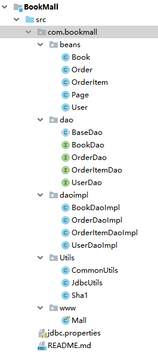

JDBC
==


## JDBC概述
### java中的数据存储技术
* 连接数据库技术分类
    * JDBC直接访问数据库
    * JDO技术
    * 第三方O/R工具，如Hibernate、ibatis等
**JDBC是java访问数据库的基石，JDO, Hibernate等只是更好的封装了JDBC**


### JDBC概念
```text
* JDBC(Java Database Connectivity)是一个独立于特定数据库管理系统、通用的SQL数据库存取和操作的公共接口（一组API），
定义了用来访问数据库的标准Java类库，使用这个类库可以以一种标准的方法、方便地访问数据库资源

另外：ODBC（Open DataBase Connectivity）

* JDBC为访问不同的数据库提供了一种统一的途径，为开发者屏蔽了一些细节问题

* JDBC的目标是使Java程序员使用JDBC可以连接任何提供了JDBC驱动程序的数据库系统。
简化和加快了开发过程
```
  

### JDBC体系结构
JDBC接口(API)包括两个层次
  

* 面向应用的API
    ```text
    Java API，抽象接口，供应用程序开发人员使用（连接数据库，执行SQL语句，获得结果）
    ```
* 面向数据库的API
    ```text
    Java Driver API，供开发商开发数据库驱动程序用
    ```

```text
JDBC驱动程序：
JDBC是sun公司提供一套用于数据库操作的接口，
java程序员只需要面向这套接口编程即可。
各个数据库厂商根据JDBC的规范制作的 JDBC 实现类的类库
```

### JDBC驱动程序四种类型
1. JDBC-ODBC桥
2. 部分本地API部分Java的驱动程序
3. JDBC网络纯Java驱动程序
4. 本地协议的纯 Java 驱动程序

第3、4种性能、可移植性、功能等方面都有优势
* JDBC-ODBC桥
    ```text
    java应用程序 -->JDBC API  -->JDBC-ODBC桥 -->ODBC API -->ODBC层 -->数据库
    
    把标准的 JDBC 调用转换成相应的 ODBC 调用，并通过 ODBC 访问数据库
    要通过多层调用，所以利用JDBC-ODBC 桥访问数据库的效率较低
    JDK中提供相应的驱动：sun.jdbc.odbc.JdbcOdbcDriver
    ```
**ODBC**  
```text
ODBC(Open Database Connectivity),放式数据库连接。微软推出的Windows平台提供统一访问数据库的方式。
所有数据库都可用ODBC API进行访问，ODBC的最大优点是能以统一的方式处理所有的数据库
```

* 部分本地API部分Java的驱动程序
    ```text
    java应用程序 -->JDBC API  -->JDBC驱动程序 -->厂商提供的本地API -->数据库
    ```

* JDBC网络纯Java驱动程序
    ```text
    java应用程序 -->JDBC API  -->JDBC驱动程序 -->应用服务器 -->厂商提供的本地API -->数据库
    ```
* 本地协议的纯 Java 驱动程序
    ```text
    java应用程序 -->JDBC API  -->JDBC驱动程序 -->数据库
    ```

### JDBC编程步骤
  


## 获取数据库连接
### JDBC API
```text
是一系列的接口，它使得应用程序能够进行数据库联接，执行SQL语句，并且得到返回结果
```


### 要素1：Driver接口实现类
* Driver接口
```text
* Java.sql.Driver 接口是所有 JDBC 驱动程序需要实现的接口

* 在程序中不需要直接去访问实现了 Driver 接口的类，而是由驱动程序管理器类(java.sql.DriverManager)去调用这些Driver实现
这种方式更灵活
```

* 加载与注册 JDBC 驱动
```text
* 加载 JDBC 驱动需调用 Class 类的静态方法 forName()，向其传递要加载的 JDBC 驱动的类名
* DriverManager 类是驱动程序管理器类，负责管理驱动程序
* 通常不用显式调用 DriverManager 类的 registerDriver() 方法来注册驱动程序类的实例，
    因为 Driver 接口的驱动程序类都包含了静态代码块，
    在这个静态代码块中，会调用 DriverManager.registerDriver() 方法来注册自身的一个实例
```

#### IntelliJ IDEA扩展jdbc Driver以及多种数据库的jdbc Driver下载地址
```text
这里以扩展全局lib为例(mysql-connector-java-8.0.18)，与扩展其他jar包方法一样。
mysql-connector-java jar包需要事先下载好，可到https://maven.aliyun.com/mvn/view，然后到
/mysql/mysql-connector-java/8.0.18/mysql-connector-java-8.0.18.jar 路径下下载该jar包。

## jdbc mysql
https://dev.mysql.com/downloads/connector/j/
如下载适用于redhat的mysql-connector-java-8.0.18-1.el8.noarch.rpm，rpm需要解压后才能得到jar包，
rpm2cpio mysql-connector-java-8.0.18-1.el8.noarch.rpm |cpio -div
jar包即在解压后的 ./usr/share/java/mysql-connector-java.jar

## jdbc postgresql
https://jdbc.postgresql.org

## jdbc oracle
https://www.oracle.com/database/technologies/appdev/jdbc-downloads.html

## jdbc sqlserver
https://docs.microsoft.com/zh-cn/sql/connect/jdbc/download-microsoft-jdbc-driver-for-sql-server?view=sql-server-ver15
```
**具体操作**  
<details>
<summary>具体操作</summary>


与添加一般的jar lib库一样
1. 点击 Project Structure  
      

2. 点击Global Libraries，点击 + 按钮，选择Java  
      

3. 路径选择框中，选择mysql-connector jar包所在的路径，再点击OK  
      

4. 在Global Libraries中把，右击mysql-connector-java-8.0.18，点击Add to Modules，添加到当前模块中  
      
</details>


### 要素2：URL
* JDBC URL 用于标识一个被注册的驱动程序，驱动程序管理器通过这个 URL 选择正确的驱动程序，从而建立到数据库的连接。

* JDBC URL的标准由三部分组成，各部分间用冒号分隔。 
    ```text
    jdbc:子协议:子名称
    
    示例：jdbc:mysql://127.0.0.1:3306/testdb?useUnicode=true&characterEncoding=UTF-8&serverTimezone=GMT%2B8&useSSL=false
    ```
    * 协议：JDBC URL中的协议总是jdbc 
    * 子协议
        ```text
        子协议用于标识一个数据库驱动程序
        ```
    * 子名称
        ```text
        一种标识数据库的方法。子名称可以依不同的子协议而变化，
        用子名称的目的是为了 定位数据库 提供足够的信息。
        包含 主机名(对应服务端的ip地址)，端口号，数据库名
        ```
    
### 要素3：用户名和密码
* user,password可以用“属性名=属性值”方式告诉数据库
* 可以调用 DriverManager 类的 getConnection() 方法建立到数据库的连接

### JDBC连接数据库示例
* [JDBC连接数据库 testDriver方法](./day01/src/com/java/www/JdbcTest.java)
    ```java
        @Test
        public void testDriver() throws SQLException {
            // 1. 创建一个Driver实现类的对象
            Driver driver = new com.mysql.jdbc.Driver();
            /*
            * mysql-connector-java-8 建议使用 com.mysql.cj.jdbc.Driver 驱动类
            * */
    
            // 2. 提供连接数据库的的基本信息：url, user, password,
            String url = "jdbc:mysql://127.0.0.1:3306/testdb?serverTimezone=Asia/Shanghai";
            Properties info = new Properties();
            info.put("user", "root");
            info.put("password", "py123456");
    
            // 3. 调用 Driver 接口的 connect(url, info) 方法
            Connection connection = driver.connect(url, info);
            System.out.println(connection);
            /*
             * Loading class `com.mysql.jdbc.Driver'.This is deprecated.
             * The new driver class is `com.mysql.cj.jdbc.Driver'.
             * The driver is automatically registered via the SPI and manual loading of the driver class is generally unnecessary.
             * */
        }
    ```
* [JDBC连接数据库 testDriverManager](./day01/src/com/java/www/DriverManagerTest.java)
    ```java
        @Test
        public void testDriverManager() throws Exception {
            // 1. 提供连接数据库的基本信息
            String driverClass = "com.mysql.cj.jdbc.Driver";
            String jdbcUrl = "jdbc:mysql://127.0.0.1:3306/testdb?useUnicode=true&characterEncoding=UTF-8&serverTimezone=GMT%2B8&useSSL=false";
            String user = "root";
            String password = "py123456";
    
            // 2. 加载数据库驱动(并自动注册驱动，com.mysql.cj.jdbc.Driver类有静态代码块 DriverManager.registerDriver(new Driver());)
            Class.forName(driverClass);
    
            // 3. 通过DriverManager 的 getConnection 方法获取数据库连接对象
            Connection connection = DriverManager.getConnection(jdbcUrl, user, password);
            System.out.println("DriverManager");
            System.out.println(connection);
        }
    ```

* [JDBC连接数据库 getConnection, 最终版](./day01/src/com/java/www/DriverManagerTest.java)
    ```java
        /**
         * 通过 DriverManager 实现类获取数据库连接对象
         *
         * @return 数据库连接对象
         * @throws Exception
         */
        public Connection getConnection() throws Exception {
            // 读取jdbc.properties文件配置
            InputStream in = getClass().getClassLoader().getResourceAsStream("jdbc.properties");
            Properties properties = new Properties();
            properties.load(in);
    
            String driverClass = properties.getProperty("driver");
            String jdbcUrl = properties.getProperty("jdbcUrl");
            String user = properties.getProperty("user");
            String password = properties.getProperty("password");
    
            // 加载数据库驱动并注册
            Class.forName(driverClass);
    
            // 通过 DriverManager类的getConnection 获取数据库连接对象，并返回
            Connection connection = DriverManager.getConnection(jdbcUrl, user, password);
            return connection;
        }
    ```
    * 工程的src目录下创建 jdbc.properties 文件，内容如下
    ```text
    # mysql connector 8
    driverClass = com.mysql.cj.jdbc.Driver
    jdbcUrl = jdbc:mysql://127.0.0.1:3306/testdb?useUnicode=true&characterEncoding=UTF-8&serverTimezone=GMT%2B8&useSSL=false
    #characterEncoding：字符集
    #serverTimezone: mysql服务器端的时区，UTC为0时区，东8区：Asia/Shanghai 或GMT%2B8
    user = root
    password = py123456
    ```
    
* **[jdbc.properties 与mysql、postgresql、oracle、sqlserver的配置示例](./day01/src/jdbc.properties)**


## 使用PreparedStatement实现CRUD操作
本次JDBC测试相关的表结构  
[employees表](./sql/employees.sql)

### 访问数据库并操作
* 数据库连接被用于向数据库服务器发送命令和 SQL 语句，并接受数据库服务器返回的结果。其实一个数据库连接就是一个Socket连接。

* 在 java.sql 包中有 3 个接口分别定义了对数据库的调用的不同方式
    * Statement：用于执行静态 SQL 语句并返回它所生成结果的对象。 
    * PrepatedStatement：SQL 语句被预编译并存储在此对象中，可以使用此对象多次高效地执行该语句。
    * CallableStatement：用于执行 SQL 存储过程  
      

### 使用Statement操作数据表及其弊端
* 通过调用 Connection 对象的 createStatement() 方法创建该对象。该对象用于执行静态的 SQL 语句，并且返回执行结果。

* Statement 接口中定义了下列方法用于执行 SQL 语句：

  ```java
  int excuteUpdate(String sql)  // 执行更新操作INSERT、UPDATE、DELETE
  ResultSet executeQuery(String sql)  // 执行查询操作SELECT
  ```

* 但是使用Statement操作数据表存在弊端：
    * **问题一：存在拼串操作，繁琐**
    * **问题二：存在SQL注入问题**

* SQL 注入是利用某些系统没有对用户输入的数据进行充分的检查，而在用户输入数据中注入非法的 SQL 语句段或命令
    ```text
    如：
    SELECT user, password FROM user_table WHERE user='a' OR 1 = ' AND password = ' OR '1' = '1') ，
    从而利用系统的 SQL 引擎完成恶意行为的做法。
    ```
* 对于 Java 而言，要防范 SQL 注入，只要用 PreparedStatement(从Statement扩展而来) 取代 Statement 就可以了。
[SQL注入测试 testSQLInjection](./day02/src/com/java/exe/JdbcTest.java)
[StatementTest](./day01/src/com/java/www/StatementTest.java)


### PreparedStatement的使用

####  PreparedStatement介绍
* 可以通过调用 Connection 对象的 **preparedStatement(String sql)** 方法获取 PreparedStatement 对象

* **PreparedStatement 接口是 Statement 的子接口，它表示一条预编译过的 SQL 语句，并对特殊字符进行转义，使用StringBuild对象来容纳sql语句的每个字符**

    原字符 | 转换后字符串
    :--- |:---  
    `\u0000` |`\\0`
    `\n` |`\\n`
    `\r` |`\\r`
    `\u001a` |`\\Z`
    `"` |`\\"`
    `\'` |`\\'`
    `\\` |`\\\\`
    `'` |`''`

* PreparedStatement 对象所代表的 SQL 语句中的参数用问号(?)来表示，
    ```text
    调用 PreparedStatement 对象的 setXxx() 方法来设置这些参数. setXxx() 方法有两个参数，
    第一个参数是要设置的 SQL 语句中的参数的索引(从 1 开始)，第二个是设置的 SQL 语句中的参数的值
    ```
* **((ClientPreparedStatement) preparedStatement).asSql()  
    可查看PreparedStatement设置参数、特殊字符等处理后的sql语句**


#### PreparedStatement vs Statement
* 代码的可读性和可维护性。

* **PreparedStatement 能最大可能提高性能**
    ```text
    * DBServer会对 预编译语句提供性能优化。
          因为预编译语句有可能被重复调用，
          所以语句在被DBServer的编译器编译后的执行代码被缓存下来，
          那么下次调用时只要是相同的预编译语句就不需要编译，
          只要将参数直接传入编译过的语句执行代码中就会得到执行
    * 在statement语句中,即使是相同操作但因为数据内容不一样,所以整个语句本身不能匹配,
          没有缓存语句的意义.事实是没有数据库会对普通语句编译后的执行代码缓存。
          这样每执行一次都要对传入的语句编译一次。
    * 语法检查，语义检查，翻译成二进制命令，缓存
    ```
* PreparedStatement 可以防止 SQL 注入 

#### java与数据库之间的数据类型转换表
java类型 |SQL类型
:--- |:---
boolean |bit 
byte |tinyint 
short |smallint 
int |int 
long |bigint 
float |float(M,D)
double |double(M,D)
String |char, varchar, longvarchar, datetime
byte array |binary, var binary 
java.sql.Date |date 
java.sql.Time |time 
java.sql.Timestamp, String |datetime 
java.sql.Timestamp |timestamp 

### 使用PreparedStatement实现增、删、改操作
[PreparedStatementTest](./day02/src/com/java/exe/PreparedStatementTest.java)  

### 使用PreparedStatement实现查询操作
[JdbcUtils get](./day02/src/com/java/exe/JdbcUtils.java)

### ResultSet与ResultSetMetaData
#### ResultSet
* 查询需要调用PreparedStatement/Statement的 executeQuery() 方法，查询结果是一个ResultSet 对象

* ResultSet 对象以逻辑表格的形式封装了执行数据库操作的结果集，ResultSet 接口由数据库厂商提供实现
* ResultSet 返回的实际上就是一张数据表。有一个指针指向数据表的第一条记录的前面。
* ResultSet 对象维护了一个指向当前数据行的**游标**
    ```text
    初始的时候，游标在第一行之前，可以通过 ResultSet 对象的 next() 方法移动到下一行。
    调用 next()方法检测下一行是否有效。
    若有效，该方法返回 true，且指针下移。
    相当于Iterator对象的 hasNext() 和 next() 方法的结合体。
    ```
* 当指针指向一行时, 可以通过调用 getXxx(int index) 或 getXxx(int columnName) 获取每一列的值。
    * 例如: getInt(1), getString("name")
    * **注意：Java与数据库交互涉及到的相关Java API中的索引都从1开始**
* ResultSet 接口的常用方法
    * boolean next()
    * getString()
    * getObject()
    * ... ...
    
      
[ResultSetTest](./day01/src/com/java/www/ResultSetTest.java)

#### ResultSetMetaData
* 可用于获取关于 ResultSet 对象中列的类型和属性信息的对象
* ResultSetMetaData meta = rs.getMetaData();
  * **getColumnName**(int column)：获取指定列的名称
  * **getColumnLabel**(int column)：获取指定列的别名
  * **getColumnCount**()：返回当前 ResultSet 对象中的列数。 
  * getColumnTypeName(int column)：检索指定列的数据库特定的类型名称。 
  * getColumnDisplaySize(int column)：指示指定列的最大标准宽度，以字符为单位。 
  * **isNullable**(int column)：指示指定列中的值是否可以为 null。 
  * isAutoIncrement(int column)：指示是否自动为指定列进行编号，这样这些列仍然是只读的。 

**问题1：得到结果集后, 如何知道该结果集中有哪些列 ？ 列名是什么？**

需要使用一个描述 ResultSet 的对象， 即 ResultSetMetaData

**问题2：关于ResultSetMetaData**

1. **如何获取 ResultSetMetaData**： 调用 ResultSet 的 getMetaData() 方法即可
2. **获取 ResultSet 中有多少列**：调用 ResultSetMetaData 的 getColumnCount() 方法
3. **获取 ResultSet 每一列的列的别名是什么**：调用 ResultSetMetaData 的getColumnLabel() 方法
  

### DatabaseMetaData
```text
DatabaseMetaData 类
是描述 数据库 的元数据对象
可以由 Connection 得到DatabaseMetaData对象
```
* 方法
    * getURL()：返回一个String类对象，代表数据库的URL
    * getUserName()：返回连接当前数据库管理系统的用户名
    * isReadOnly()：返回一个boolean值，指示数据库是否只允许读操作
    * getDatabaseProductName()：返回数据库的产品名称
    * getDatabaseProductVersion()：返回数据库的版本号
    * getDriverName()：返回驱动驱动程序的名称
    * getDriverVersion()：返回驱动程序的版本号

[DatabaseMetaDataTest](./day03/src/com/java/www/DatabaseMetaDataTest.java)  

### 获取插入数据时自动生成的主键值
[testGetKeyValue](./day03/src/com/java/www/JdbcTest.java)


### 资源的释放
* 释放ResultSet, Statement,Connection。
* 数据库连接（Connection）是非常稀有的资源，用完后必须马上释放，如果Connection不能及时正确的关闭将导致系统宕机。
Connection的使用原则是**尽量晚创建，尽量早的释放。**
* 可以在finally中关闭，保证及时其他代码出现异常，资源也一定能被关闭。

### JDBC API小结
- 两种思想
    - 面向接口编程的思想
    - ORM思想(object relational mapping)
        - 一个数据表对应一个java类
        - 表中的一条记录对应java类的一个对象
        - 表中的一个字段对应java类的一个属性
    > sql是需要结合列名和表的属性名来写。注意起别名。

- 两种技术
    - JDBC结果集的元数据：ResultSetMetaData
        - 获取列数：getColumnCount()
        - 获取列的别名：getColumnLabel()
    - 通过反射，创建指定类的对象，获取指定的属性并赋值


## [章节练习](day02/src/com/java/exercise/README.md)

## 操作BLOB类型字段
### MySQL BLOB类型
- MySQL中，BLOB是一个二进制大型对象，是一个可以存储大量数据的容器，它能容纳不同大小的数据。
- 插入BLOB类型的数据必须使用PreparedStatement，因为BLOB类型的数据无法使用字符串拼接写的。
- MySQL的四种BLOB类型(除了在存储的最大信息量上不同外，他们是等同的)

    类型  |最大空间
    :--- |:---
    TINYBLOB |255 Byte
    BLOB |65 KB
    MEDIUMBLOB |16 MB
    LONGBLOB |4 GB
- 实际使用中根据需要存入的数据大小定义不同的BLOB类型。
- 需要注意的是：如果存储的文件过大，数据库的性能会下降。
- 如果在指定了相关的Blob类型以后，还报错：xxx too large
    ```text
    那么在mysql的安装目录下，找my.cnf文件加上如下的配置参数： 
    max_allowed_packet = 16M
    同时注意：修改了my.ini文件之后，需要重新启动mysql服务。
    ```
### 向数据表中插入BLOB数据类型
[testInsertBlob](./day03/src/com/java/www/JdbcTest.java)

### 更新数据表中的BLOB类型字段
[testUpdateBlob](./day03/src/com/java/www/JdbcTest.java)

### 读取BLOB类型数据
[readBlob](./day03/src/com/java/www/JdbcTest.java)


## JDBC中处理事务
本节相关表  
[account表sql](sql/account.sql)

- 数据一旦提交，就不可回滚。
- 数据什么时候意味着提交？
    - **当一个连接对象被创建时，默认情况下是自动提交事务**
        ```text
        每次执行一个 SQL 语句时，如果执行成功，就会向数据库自动提交，而不能回滚。
        ```
    - **关闭数据库连接，数据就会自动的提交** 
        ```text
        如果多个操作，每个操作使用的是自己单独的连接，则无法保证事务。
        即同一个事务的多个操作必须在同一个连接下。
        ```
    * **JDBC程序中为了让多个 SQL 语句作为一个事务执行**
        - 调用 Connection 对象的 **setAutoCommit(false)** 以取消自动提交事务
        - 在所有的 SQL 语句都成功执行后，调用 **commit()** 方法提交事务
        - 在出现异常时，调用 **rollback()** 方法回滚事务
    > 若此时 Connection 没有被关闭，还可能被重复使用，  
    则需要恢复其自动提交状态 setAutoCommit(true)  
    尤其是在使用数据库连接池技术时，执行close()方法前，  
    建议恢复自动提交状态

* 不使用事务情况：张无忌账号转账100到赵敏账号
[testNonTransaction](day03/src/com/java/www/TransactionTest.java)

* 使用事务情况：张无忌账号转账100到赵敏账号
[testTransaction](day03/src/com/java/www/TransactionTest.java)

### JDBC事务隔离级别
测试事务隔离级别  
[testTransactionIsolationUpdate、testTransactionIsolationRead](day03/src/com/java/www/TransactionTest.java)  


## 批量插入
### 批量执行SQL语句
当需要成批插入或者更新记录时，可以采用Java的批量**更新**机制，这一机制允许多条语句一次性提交给数据库批量处理。通常情况下比单独提交处理更有效率

JDBC的批量处理语句包括下面三个方法：
- **addBatch(String)：添加需要批量处理的SQL语句或是参数；**
- **executeBatch()：执行批量处理语句；**
- **clearBatch():清空缓存的数据**

通常我们会遇到两种批量执行SQL语句的情况：
- 多条SQL语句的批量处理
- 一个SQL语句的批量传参

[批量插入数据的几种方式](day04/src/com/java/www/BatchInsertTest.java)  

## DAO
```text
Data Access Object 数据访问对象.

## 定义
访问数据信息的类，包含了对数据的CRUD(create, read, update, delete)操作，
不包含任何业务相关的信息

## 优点
实现功能的模块化，更有利于代码的维护和升级
```
* DAO示例  
    [DAO v1](day03/src/com/java/www/DAO.java)  
    [DAO v2](day04/src/com/java/www/DaoJdbcImpl.java)  
    [DAO v3](BookMall/src/com/bookmall/dao/BaseDao.java)  
    
### DAO项目示例：BookMall
[项目说明](BookMall/README.md)

* 目录结构

      

* 类关系图

      
    
      


## BeanUtils
```text
大多数Java开发人员都习惯于创建符合属性getter和setter的JavaBeans命名模式的Java类。
然后通过调用相应的getXxx和setXxx方法。
在某些情况下，需要对Java对象属性进行动态访问。
BeanUtils组件为这些功能提供了易于使用的包装。

https://commons.apache.org/proper/commons-beanutils/
http://commons.apache.org/proper/commons-logging/
http://commons.apache.org/collections/

* compile编译依赖的jar包
    commons-collections-3.2.2.jar
    commons-logging-1.2.jar
* 测试依赖的jar包
    commons-collections-testframework-3.2.1.jar
    junit-4.12.jar
    hamcrest-core-1.3.jar
```
[Apache Commons BeanUtils](day03/src/com/java/www/BeanUtilsTest.java)  

[自定义Bean反射工具](day02/src/com/java/exe/ReflectionUtils.java)

## DbUtils
```
https://commons.apache.org/proper/commons-dbutils/
依赖jar包：commons-dbutils.jar
```

**[DbUtils 测试](day04/src/com/java/www/DbUtilsTest.java)**  

### DbUtils简介
```text
commons-dbutils 是 Apache 组织提供的一个开源 JDBC工具类库，
它是对JDBC的简单封装，学习成本极低，
并且使用dbutils能极大简化jdbc编码的工作量，
同时也不会影响程序的性能。
```
- API介绍
    - org.apache.commons.dbutils.QueryRunner
    - org.apache.commons.dbutils.ResultSetHandler
    - 工具类：org.apache.commons.dbutils.DbUtils  

### DbUtils API主要方法
- DbUtils ：提供如关闭连接、装载JDBC驱动程序等常规工作的工具类，里面的所有方法都是静态的。主要方法如下：
    - **public static void close(…) throws java.sql.SQLException**
        ```text
        DbUtils类提供了三个重载的关闭方法。
        这些方法检查所提供的参数是不是NULL，
        如果不是的话，它们就关闭Connection、Statement和ResultSet。
        ```
    - public static void closeQuietly(…):
        ```text
        这一类方法不仅能在Connection、Statement和ResultSet为NULL情况下避免关闭，
        还能隐藏一些在程序中抛出的SQLEeception。
        ```
    - public static void commitAndClose(Connection conn)throws SQLException
        ```text
        用来提交连接的事务，然后关闭连接
        ```
    - public static void commitAndCloseQuietly(Connection conn)
        >用来提交连接，然后关闭连接，并且在关闭连接时不抛出SQL异常。 
    - public static void rollback(Connection conn)throws SQLException
        >允许conn为null，因为方法内部做了判断
    - public static void rollbackAndClose(Connection conn)throws SQLException
    - rollbackAndCloseQuietly(Connection)
    - public static boolean loadDriver(java.lang.String driverClassName)
        >这一方装载并注册JDBC驱动程序，如果成功就返回true。使用该方法，你不需要捕捉这个异常ClassNotFoundException。
### QueryRunner类
- **该类简单化了SQL查询，它与ResultSetHandler组合在一起使用可以完成大部分的数据库操作，能够大大减少编码量。**

- QueryRunner类提供了两个构造器：
    - 默认的构造器
    - 需要一个 javax.sql.DataSource 来作参数的构造器

- QueryRunner类的主要方法
    - 更新
        - public int update(Connection conn, String sql, Object... params) throws SQLException
            >用来执行一个更新（插入、更新或删除）操作。
        - ......
    - **插入**
        - public <T> T insert(Connection conn,String sql,ResultSetHandler<T> rsh, Object... params) throws SQLException
            ```text
            只支持INSERT语句，可获取自动生成的主键值
            其中 rsh - The handler used to create the result object from the ResultSet of auto-generated keys.  
            返回值: An object generated by the handler.即自动生成的键值
            ```
        - ....
    - 批处理
        - public int[] batch(Connection conn,String sql,Object[][] params)throws SQLException
            >INSERT, UPDATE, or DELETE语句
        - public <T> T insertBatch(Connection conn,String sql,ResultSetHandler<T> rsh,Object[][] params)throws SQLException
            >只支持INSERT语句
        - .....
    - 查询
        - public Object query(Connection conn, String sql, ResultSetHandler rsh,Object... params) throws SQLException
            ```text
            执行一个查询操作，在这个查询中，对象数组中的每个元素值被用来作为查询语句的置换参数。
            该方法会自行处理 PreparedStatement 和 ResultSet 的创建和关闭。
            ```
        - ...... 
        
### ResultSetHandler接口及实现类
- 该接口用于处理 java.sql.ResultSet，将数据按要求转换为另一种形式。
- ResultSetHandler 接口提供了一个单独的方法：Object handle (java.sql.ResultSet .rs)。
- 接口的主要实现类
    - ArrayHandler
        >把结果集中的第一行数据转成对象数组。
    - ArrayListHandler
        >把结果集中的每一行数据都转成一个数组，再存放到List中。
    - **BeanHandler**
        >将结果集中的第一行数据封装到一个对应的JavaBean实例中。
    - **BeanListHandler**
        >将结果集中的每一行数据都封装到一个对应的JavaBean实例中，存放到List里。
    - ColumnListHandler
        >将结果集中某一列的数据存放到List中
    - KeyedHandler(name)
        >将结果集中的每一行数据都封装到一个Map里，再把这些map再存到一个map里，其key为指定的key。
    - **MapHandler**
        >将结果集中的第一行数据封装到一个Map里，key是列名，value就是对应的值。
    - **MapListHandler**
        >将结果集中的每一行数据都封装到一个Map里，然后再存放到List
    - **ScalarHandler**
        >查询单个值对象
        
### QueryLoader
```text
可以用来加载存放着 SQL 语句的资源文件.
使用该类可以把 SQL 语句存放到一个资源文件中. 以提供更好的解耦
```
[testQueryLoader](day04/src/com/java/www/DbUtilsTest.java)

## 数据库连接池
### JDBC数据库连接池的必要性
- 在使用开发基于数据库的web程序时，传统的模式基本步骤　　
    - 在主程序（如servlet、beans）中建立数据库连接
    - 进行sql操作
    - 断开数据库连接

- 这种模式开发，存在的问题
```text
* 普通的JDBC数据库连接使用 DriverManager 来获取，
    每次向数据库建立连接的时候都要将 Connection 加载到内存中，
    再验证用户名和密码(得花费0.05s～1s的时间)。
    需要数据库连接的时候，就向数据库要求一个，执行完成后再断开连接。
    这样的方式将会消耗大量的资源和时间。
    数据库的连接资源并没有得到很好的重复利用。
    
    若同时有几百人甚至几千人在线，频繁的进行数据库连接操作将占用很多的系统资源，
    严重的甚至会造成服务器的崩溃。
    
* 对于每一次数据库连接，使用完后都得断开。
    否则，如果程序出现异常而未能关闭，将会导致数据库系统中的内存泄漏，
    最终将导致重启数据库。
    
* 这种开发不能控制被创建的连接对象数，系统资源会被毫无顾及的分配出去，
    如连接过多，也可能导致内存泄漏，服务器崩溃。 
```
### 数据库连接池技术
- 为解决传统开发中的数据库连接问题，可以采用数据库连接池技术
- **数据库连接池的基本思想**
    ```text
    就是为数据库连接建立一个“缓冲池”。
    预先在缓冲池中放入一定数量的连接，
    当需要建立数据库连接时，
    只需从“缓冲池”中取出一个，使用完毕之后再放回去。
    ```
- **数据库连接池**负责分配、管理和释放数据库连接
    >它允许应用程序重复使用一个现有的数据库连接，而不是重新建立一个
- 数据库连接池在初始化时将创建一定数量的数据库连接放到连接池中
    ```text
    这些数据库连接的数量是由 最小数据库连接数来设定 的。
    无论这些数据库连接是否被使用，连接池都将一直保证至少拥有这么多的连接数量。
    连接池的 最大数据库连接数量 限定了这个连接池能占有的最大连接数，
    当应用程序向连接池请求的连接数超过最大连接数量时，这些请求将被加入到等待队列中。
    ```
      
    
**数据库连接池原理**  
  

* 数据库连接池技术的优点
    * 资源重用
    * 更快的系统反应速度
    * 新的资源分配手段
    * 统一的连接管理，避免数据库连接泄漏

### 多种开源的数据库连接池
```text
JDBC 的数据库连接池使用 javax.sql.DataSource 来表示，
DataSource 只是一个接口，该接口通常由服务器(Weblogic, WebSphere, Tomcat)提供实现

DataSource 通常被称为数据源，它包含连接池和连接池管理两个部分，
习惯上也经常把 DataSource 称为连接池.

DataSource用来取代DriverManager来获取Connection，获取速度快，同时可以大幅度提高数据库访问速度。
```
- **DBCP**  
    是Apache提供的数据库连接池。tomcat 服务器自带dbcp数据库连接池。**速度相对c3p0较快**，但因自身存在BUG，Hibernate3已不再提供支持。
- **C3P0**  
    是一个开源组织提供的一个数据库连接池，**速度相对较慢，稳定性还可以。** Hibernate官方推荐使用
- **Proxool**  
    是sourceforge下的一个开源项目数据库连接池，有监控连接池状态的功能，**稳定性较c3p0差一点**
- **BoneCP**  
    是一个开源组织提供的数据库连接池，速度快
- **Druid**  
    ```text
    是阿里提供的数据库连接池，据说是集DBCP 、C3P0 、Proxool 优点于一身的数据库连接池，
    但是速度不确定是否有BoneCP快。
    同时加入了日志监控，可以很好的监控DB池连接和SQL的执行情况
    ```

**特别注意**
- 数据源和数据库连接不同，数据源无需创建多个，它是产生数据库连接的工厂，  
    因此**整个应用只需要一个数据源即可。**
- 当数据库访问结束后，程序还是像以前一样关闭数据库连接：conn.close();   
    但conn.close()并没有关闭数据库的物理连接，它仅仅把数据库连接释放，归还给了数据库连接池。

### DBCP数据库连接池
```text
DBCP
https://commons.apache.org/proper/commons-dbcp/index.html
Apache Commons DBCP 2.7.0 for JDBC 4.2 on Java 8
依赖jar包：commons-dbcp.jar、commons-pool.jar、commons-logging.jar

```

* dbcp.properties配置文件
```text
##DBCP连接池
#文件放置于src classpath根目录下
#必填写参数
driverClassName = com.mysql.cj.jdbc.Driver
url= jdbc:mysql://127.0.0.1:3306/testdb?useUnicode=true&characterEncoding=UTF-8&serverTimezone=GMT%2B8&useSSL=false
username = root
password = py123456

#可选参数
initialSize = 10
maxTotal = 50
maxIdle = 10
minIdle = 2
maxWaitMillis = 5000
```

* 配置属性说明

| 属性                       | 默认值 | 说明                                                         |
| -------------------------- | ------ | ------------------------------------------------------------ |
| initialSize                | 0      | 连接池启动时创建的初始化连接数量                             |
| maxActive                  | 8      | 连接池中可同时连接的最大的连接数                             |
| maxIdle                    | 8      | 连接池中最大的空闲的连接数，超过的空闲连接将被释放，如果设置为负数表示不限制 |
| minIdle                    | 0      | 连接池中最小的空闲的连接数，低于这个数量会被创建新的连接。该参数越接近maxIdle，性能越好，因为连接的创建和销毁，都是需要消耗资源的；但是不能太大。 |
| maxWait                    | 无限制 | 最大等待时间，当没有可用连接时，连接池等待连接释放的最大时间，超过该时间限制会抛出异常，如果设置-1表示无限等待 |
| poolPreparedStatements     | false  | 开启池的Statement是否prepared                                |
| maxOpenPreparedStatements  | 无限制 | 开启池的prepared 后的同时最大连接数                          |
| minEvictableIdleTimeMillis |        | 连接池中连接，在时间段内一直空闲， 被逐出连接池的时间        |
| removeAbandonedTimeout     | 300    | 超过时间限制，回收没有用(废弃)的连接                         |
| removeAbandoned            | false  | 超过removeAbandonedTimeout时间后，是否进 行没用连接（废弃）的回收 |

* DBCP示例  
[DbcpUtils](day04/src/com/java/www/DbcpUtils.java)  
[DbcpTest](day04/src/com/java/www/DbcpTest.java)  
[dbcp.properties配置示例](day04/src/dbcp.properties)  

### c3p0数据库连接池
```text
官网
https://www.mchange.com/projects/c3p0/
jar包下载
https://sourceforge.net/projects/c3p0/

依赖jar包：c3p0.jar、commons-logging.jar

配置文件示例：
https://www.mchange.com/projects/c3p0/#configuration_files

当c3p0.properties、c3p0-config.xml配置文件同时存在时，优先使用c3p0-config.xml配置
```

#### c3p0 properties风格配置
在src目录创建c3p0.properties
* 配置示例  
[c3p0.properties](day04/src/c3p0.properties)  

#### c3p0 xml风格配置
在src目录创建c3p0-config.xml
* 关闭日志
    ```text
    在src目录创建mchange-log.properties，内容添加如下内容
    
    ##关闭c3p0日志
    com.mchange.v2.log.MLog = com.mchange.v2.log.FallbackMLog
    com.mchange.v2.log.FallbackMLog.DEFAULT_CUTOFF_LEVEL = OFF
    ```
* 配置示例  
[c3p0-config.xml](day04/src/c3p0-config.xml)  

#### c3p0示例
[C3p0Test](day04/src/com/java/www/C3p0Test.java)  
[C3p0Utils](day04/src/com/java/www/C3p0Utils.java)  


### Druid数据库连接池


## 使用JDBC调用数据库中的存储过程、函数
### JDBC调用存储过程
```text
CallableStatement接口方法
registerOutParameter(int parameterIndex, int sqlType) 设置OUT类型参数值
setXxx() 设置IN、OUT、INOUT参数值，setObject方法更简单
null值可以用callableStatement.setNull(int parameterIndex, int sqlType);
JDBC调用的存储过程的SQL语法：{call 存储过程名(参数...)};
```
* 先创建存储过程
    ```mysql
    -- 存储过程：输入用户名、密码，返回登录是否成功
    DELIMITER $
    CREATE PROCEDURE login_procdr(IN username VARCHAR(32), IN pwd VARCHAR(32), OUT valid INT)
    /*
    IN:
        username: 用户名
        pwd: 密码
    
    OUT:
        valid: 登录是否有效
                0: 无效
                非0: 有效
    
    */
    BEGIN
        SET valid = 0;                     
        SELECT COUNT(*) INTO valid
        FROM employees
        WHERE `name` = username AND passwd = pwd;
        
    END$
    DELIMITER ;
    
    CALL login_procdr('马云', 'my123', @s);
    SELECT @s;
    ```

* JDBC调用存储过程  
    [testCallableStatment](day05/src/com/java/www/JdbcTest.java)  

### JDBC调用函数
```text
与一般的查询一样
```
* 先创建自定义函数
    ```mysql
    -- 函数：输入用户名、密码，返回登录是否成功
    DELIMITER $
    
    CREATE FUNCTION login_func(username VARCHAR(32), pwd VARCHAR(32)) RETURNS INT
    /*
    username: 用户名
    pwd: 密码
    
    RETURNS: 登录是否有效
        0: 无效
        非0: 有效
    */
    BEGIN
        SET @valid = 0;
        SELECT COUNT(*) INTO @valid
        FROM employees
        WHERE `name` = username AND passwd = pwd;
        RETURN @valid;
    END$
    DELIMITER ;
    ```
* JDBC调用函数  
    [testFunction](day05/src/com/java/www/JdbcTest.java)  